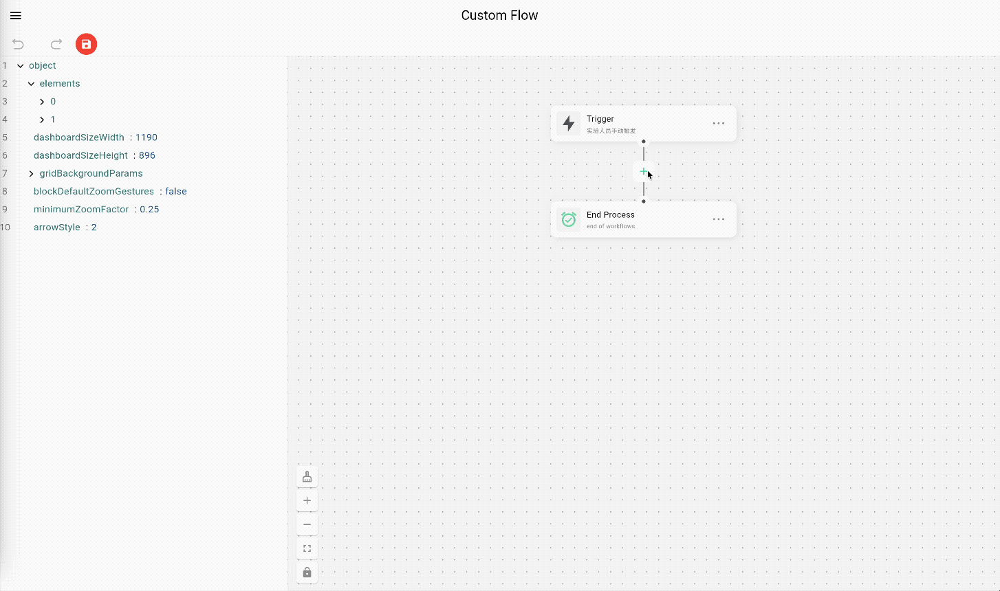

# flutter_easy_flow

`flutter_easy_flow` is a Flutter project designed to simplify the process of creating and managing flow diagrams. 

## 🚀 Features Showcase

Here are some of the key features of `flutter_easy_flow` in action:

- **Node Management**: Easily add, delete, and modify nodes to create detailed flow diagrams.
- **Group Nodes**: Efficiently manage complex diagrams by grouping nodes.
- **Real-time Data Rendering**: Automatically render flow diagrams based on real-time data.
- **Real-time Data Viewing**: View the underlying data of flow diagrams in real-time.

// 

## 🛠️ Installation

To get started with `flutter_easy_flow`, follow these steps:

1. Clone the repository:
2. Navigate to the project directory:
    ```bash
    cd flutter_easy_flow
    ```
3. Install dependencies:
    ```bash
    flutter pub get
    ```
4. Run the app:
    ```bash
    flutter run
    ```

### 🤝 Contributing

Welcome contributions from the community. If you would like to contribute, please follow these steps:

1. Fork the repository.
2. Create a new branch for your feature or bugfix.
3. Commit your changes and push the branch to your fork.
4. Create a pull request with a detailed description of your changes.

### 📝 TODO

Here are some upcoming features that are planned for `flutter_easy_flow`:

1. **Collapsible Group Nodes**: Add support for collapsing and expanding group nodes to manage complex diagrams more efficiently.
2. **Local Data Persistence**: Save canvas data locally and support data restoration to continue work seamlessly.
3. **Animated JSON Data Panel**: Introduce an animated panel on the left side to expand or collapse JSON data for better data management.

## 🌐 GitHub Pages Deployment

To deploy `flutter_easy_flow` to GitHub Pages, follow these steps:

1. Build the web version of the app with the correct base href:
    ```bash
    flutter build web --base-href=/Flutter-EasyFlow/
    ```
2. Copy the contents of the `build/web/` directory to the `/docs` directory:
    ```bash
    cp -r build/web/* docs/
    ```
3. Commit your changes and push them to the repository:
    ```bash
    git add docs/
    git commit -m "Deploy to GitHub Pages"
    git push origin main
    ```
    
## Stargazers over time
[](https://starchart.cc/Jason-chen-coder/Flutter-EasyFlow)

### 📄 License

This project is licensed under the MIT License. See the [LICENSE](LICENSE) file for more details.

